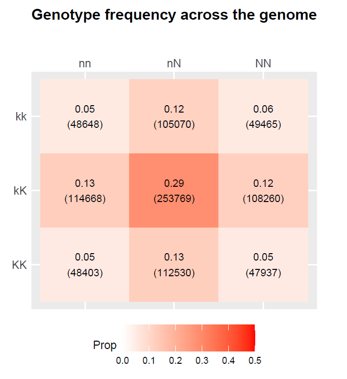

# f2.polyploid

(version 1.0.0)

The GitHub repository [biostat-interns-2021/Polyploid](https://github.com/biostat-interns-2021/Polyploid) contains the following material.

(**[biostat-interns-2021/Polyploid](https://github.com/biostat-interns-2021/Polyploid) has not been published yet.**)

- HTML tutorial: [`f2.polyploid_tutorial.html`](https://bae-y.github.io/f2.polyploid/f2.polyploid_tutorial.html)
- R source codes:`f2.polyploid_analysis.R` and `f2.polyploid_plot.R`
- Example R script: `example_codes.R`
- Genome scan results: `lod_[SITE].csv`
- Permutation test results: `perm.test_max.lod_[SITE].csv`
- Visualizations of results: `plot_*.pdf`


## 0. Tutorial

Now available at [`f2.polyploid_tutorial.html`](https://bae-y.github.io/f2.polyploid/f2.polyploid_tutorial.html)


## 1. Introduction to f2.polyploid

f2.polyploid is a suite of tools to perform polyploidy-aware QTL analysis in F2 samples of allopolyploid species. The goal is to identify genotype-phenotype associations of an allopolyploid. We hope our tool will give more insights into genetic architecture of allopolyploidy.

The procedure of f2.polyploid tools consists of two parts:

1) scan the allopolyploid genome and
2) visualize the genome-scan results. 

When scanning the genome, we use the single-marker regression to model each genetic marker. To test various assumptions regarding the redundancy and differentiation in allopolyploid genome duplication event, we generate orthogonal contrasts and compute LOD scores ($\log_{10}$ likelihood ratios). We visualize the density of LOD scores and select the markers with high LOD scores to plot their effects on the trait.

We provide a tutorial and example R script. Please look at [`f2.polyploid_tutorial.html`](https://bae-y.github.io/f2.polyploid/f2.polyploid_tutorial.html) and `example_codes.R`.

### Requirements

R packages:

```R
require(lmtest)
require(tictoc)
require(qtl)
require(dplyr)
require(tidyr)
require(ggplot2)
require(ggpubr)
require(gridExtra)
require(grid)
require(ggridges)
require(viridis)
```

Data inputs:

- Phenotype data
  - must include sample id, location id, and quantitative traits.
  - location information (e.g. latitude) is a plus for visualization.
- Genotype data
  - must include sample id, marker id, marker position/location, and genotypes

## 2. Visualization of f2.polyploid

As performed in the tutorial, we obtain the following figures by applying f2.polyploid to the genotype and phenotype datasets for the 4-way intercross switchgrass (*Panicum virgatum*), a allotetraploid species.

### Data visualization



### LOD curves and 95% significance thresholds


### Histogram for maximum LOD scores of permutation test


### Genotype frequency at the markers with LOD peaks


### Distribution of trait at the markers with LOD peaks


### Comparison of LOD scores in different sites


### Allelic effects at the markers with LOD peaks on trait


## 3. Overview of f2.polyploid Functions

### Functions in `f2.polyploid_analysis.R`

```
# To build a contrast matrix
contrasts_f2.polyploid(geno, mode=c("current ver", "developer"))
```
This returns a contrast matrix. The option `mode="current ver"` returns the contrasts we propose. The option `mode="developer"` for developing and trying a new contrast.


```
# To run genome scan or permutation test
scanone_f2.polyploid(geno, pheno, pheno.col=1, genotype=c("A|C","B|D","E|G","F|H"), 
                     alleles=c("n","N","k","K"), c.mat=NULL, n.perm=NULL, ...)
```
Assign `n.perm` the number you want to repeat shuffling phenotype data.


### Functions in `f2.polyploid_plot.R`

```
# To plot LOD curves from the genome scan output
plot_scanone_f2.polyploid(object, operm_list=NULL, phenonames, ncontrasts=13)
```

```
# To plot histogram of maximum LOD scores from the permutation test output
plot_operm_f2.polyploid(operm_list, phenonames, ncontrasts=13)
```

```
# To plot heatmap of genotype frequency at a marker
plot_geno.freq(geno, genotype=c("A|C","B|D","E|G","F|H"), alleles=c("n","N","k","K"),
               phenonames, object, ncontrasts=13)
```
```
# To plot Punnett square at a marker
plot_punnett(geno, genotype=c("A|C","B|D","E|G","F|H"), alleles=c("n","N","k","K"),
             pheno, phenonames, object, ncontrasts=13)
```

```
# To plot allelic effects plot at a marker
plot_alleic_effect(geno, genotype=c("A|C","B|D","E|G","F|H"), alleles=c("n","N","k","K"), 
                   pheno, phenonames, object, ncontrasts=13)
```

```
# To plot violin plot for trait at a marker
violin_trait_marker(object, geno, genotype=c("A|C","B|D","E|G","F|H"), alleles=c("n","N","k","K"), 
                    pheno, phenonames, ncontrasts=13)
```

```
# To plot ridgeline for LOD score
ridgeline_lod(object, phenonames)
```


## References

Lovell, John; Healey, Adam; Schmutz, Jeremy; Juenger, Thomas (2020), Switchgrass v5 4-way (AP13 x DAC, WBC x VS16) genetic map, Dryad, Dataset, https://doi.org/10.5061/dryad.ghx3ffbjv


## Author

Ye Eun Bae (Department of Statistics, Florida State University)
